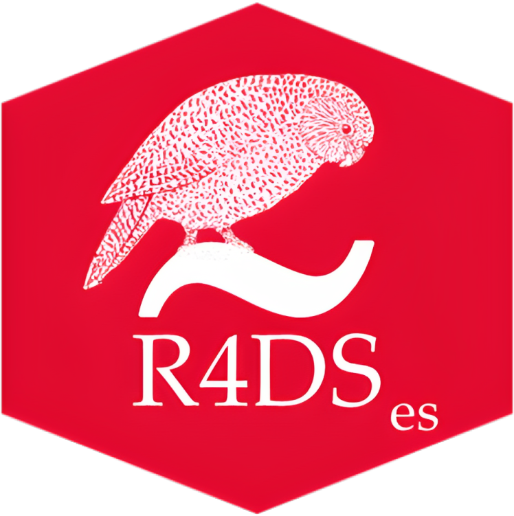

# Español

## R para la Ciencia de Datos

<a href="https://amzn.to/2aHLAQ1"></a> Este repositorio contiene el código fuente del libro **"R para la Ciencia de Datos"** de Hadley Wickham, Mine Çetinkaya-Rundel & Garrett Grolemund.
El libro está construido usando [Quarto](https://quarto.org/).
Este libro le enseñará cómo hacer ciencia de datos con R: aprenderá cómo obtener sus datos en R, convertirlos en la estructura más útil, transformarlos y visualizarlos.

En este libro, encontrará ejercicios prácticos para aprender las habilidades necesarias para la ciencia de datos.
Así como un químico aprende a limpiar tubos de ensayo y abastecer un laboratorio, usted aprenderá a limpiar datos y dibujar diagramas, y mucho más.
Estas son las habilidades que hacen que exista la ciencia de datos, y aquí encontrará las mejores prácticas para hacer cada una de estas cosas con R.
Aprenderá a usar la gramática de los gráficos, la programación literaria y la investigación reproducible para ahorrar tiempo.
También aprenderá a administrar los recursos cognitivos para facilitar los descubrimientos al discutir, visualizar y explorar datos.

## Sobre la traducción

Esta traducción de "R para la Ciencia de Datos" es un proyecto personal de [David Díaz Rodríguez](https://github.com/davidrsch) con el objetivo de facilitar el estudio de la Ciencia de Datos con R, tanto al propio traductor como a todas aquellas personas de habla hispana que deseen aprender a realizar Ciencia de Datos con R.

Señalar que esta es una traducción textual del libro por lo que cuando los autores se refieren así mismo en primera persona, será Hadley Wickham, Mine Çetinkaya-Rundel & Garrett Grolemund y no el traductor.

### Traducido hasta ahora

-   0.1 Bienvenida
-   0.2 Prefacio de la segunda edición
-   1 Introducción
-   El Juego Completo
    -   2 Visualización de datos
    -   3 Flujo de trabajo: conceptos básicos
    -   4 Transformación de datos

## Sobre otras versiones

-   Original en inglés
    -   Copia online en [R for Data Science](http://r4ds.hadley.nz)
    -   Comprar copia física en [R for Data Science](https://amzn.to/2aHLAQ1)
-   Español (otro proyecto distinto de este) copia online en [R para la Ciencia de Datos](https://es.r4ds.hadley.nz/)
-   Italiano copia online en [R for Data Science - edizione italiana](https://it.r4ds.hadley.nz/)
-   Turco copia online [R for Data Science](https://tr.r4ds.hadley.nz/)

## Más información acerca del repositorio

Los paquetes R utilizados en este libro se pueden instalar a través de:

```{r}
devtools::install_github("hadley/r4ds")
```

### Imágenes

#### Dibujos Omnigraffle

-   Fuente: 12pt Guardian Sans Condensed / Ubuntu mono

-   Exportar como png de 300 dpi.

-   La fuente del sitio web es de 18 px = 13,5 pt, así que escale los dpi para que coincida con los tamaños de fuente: 270 = 300 \* 12/13,5.
    (También verifiqué esto empíricamente mediante una captura de pantalla).

    ``` r
    #| echo: FALSE
    #| out.width: NULL
    knitr::include_graphics("diagrams/transform.png", dpi = 270)
    ```

#### Capturas de pantalla

-   Asegúrate de estar usando un tema claro.
    Para elementos pequeños de la interfaz (p. ej., barras de herramientas), amplíe dos veces.

-   Captura de pantalla con Cmd + Shift + 4.

-   No es necesario configurar dpi:

    ``` r
    #| echo: FALSE
    #| out.width: NULL
    knitr::include_graphics("screenshots/rstudio-wg.png")
    ```

#### O'Reilly

Para generar un libro para O'Reilly, construya el libro y luego:

```{r}
devtools::load_all("../minibook/"); process_book()

html <- list.files("oreilly", pattern = "[.]html$", full.names = TRUE)
file.copy(html, "../r-for-data-science-2e/", overwrite = TRUE)

pngs <- list.files("oreilly", pattern = "[.]png$", full.names = TRUE, recursive = TRUE)
dest <- gsub("oreilly", "../r-for-data-science-2e/", pngs)
fs::dir_create(unique(dirname(dest)))
file.copy(pngs, dest, overwrite = TRUE)
```

# English

## R for Data Science

<a href="https://amzn.to/2aHLAQ1"></a>This repository contains the source of **"R for Data Science"** book by Hadley Wickham, Mine Çetinkaya-Rundel & Garrett Grolemund.
The book is built using [Quarto](https://quarto.org/).
This book will teach you how to do data science with R: You'll learn how to get your data into R, get it into the most useful structure, transform it and visualize.

In this book, you will find a practicum of skills for data science.
Just as a chemist learns how to clean test tubes and stock a lab, you'll learn how to clean data and draw plots---and many other things besides.
These are the skills that allow data science to happen, and here you will find the best practices for doing each of these things with R.
You'll learn how to use the grammar of graphics, literate programming, and reproducible research to save time.
You'll also learn how to manage cognitive resources to facilitate discoveries when wrangling, visualizing, and exploring data.

## About the translation

This translation of "R for Data Science" is a personal project by [David Díaz Rodríguez](https://github.com/davidrsch) with the aim of facilitating the study of Data Science with R, both for the translator himself and for all those Spanish-speaking people who wish to learn to do Data Science with R.

Note that this is a verbatim translation of the book so when the authors refer to themselves in the first person, it will be Hadley Wickham, Mine Çetinkaya-Rundel & Garrett Grolemund and not the translator.

### Translated so far

-   0.1 Wellcome
-   0.2 Preface to the second edition
-   1 Introduction
-   Whole Game
    -   2 Data visualization
    -   3 Workflow: basics
    -   4 Data transformation

## About other versions

-   Original in English
    -   Online copy at [R for Data Science](http://r4ds.hadley.nz)
    -   Buy physical copy at [R for Data Science](https://amzn.to/2aHLAQ1)
-   Spanish (another project different from this one) online copy en [R para la Ciencia de Datos](https://es.r4ds.hadley.nz/)
-   Italian copy online at [R for Data Science - edizione italiana](https://it.r4ds.hadley.nz/)
-   Turkish copy online [R for Data Science](https://tr.r4ds.hadley.nz/)

## More info about the repository

The R packages used in this book can be installed via:

```{r}
devtools::install_github("hadley/r4ds")
```

### Images

#### Omnigraffle drawings

-   Font: 12pt Guardian Sans Condensed / Ubuntu mono

-   Export as 300 dpi png.

-   Website font is 18 px = 13.5 pt, so scale dpi to match font sizes: 270 = 300 \* 12 / 13.5.
    (I also verified this empirically by screenshotting.)

    ``` r
    #| echo: FALSE
    #| out.width: NULL
    knitr::include_graphics("diagrams/transform.png", dpi = 270)
    ```

#### Screenshots

-   Make sure you're using a light theme.
    For small interface elements (eg. toolbars), zoom in twice.

-   Screenshot with Cmd + Shift + 4.

-   Don't need to set dpi:

    ``` r
    #| echo: FALSE
    #| out.width: NULL
    knitr::include_graphics("screenshots/rstudio-wg.png")
    ```

#### O'Reilly

To generate book for O'Reilly, build the book then:

```{r}
devtools::load_all("../minibook/"); process_book()

html <- list.files("oreilly", pattern = "[.]html$", full.names = TRUE)
file.copy(html, "../r-for-data-science-2e/", overwrite = TRUE)

pngs <- list.files("oreilly", pattern = "[.]png$", full.names = TRUE, recursive = TRUE)
dest <- gsub("oreilly", "../r-for-data-science-2e/", pngs)
fs::dir_create(unique(dirname(dest)))
file.copy(pngs, dest, overwrite = TRUE)
```
